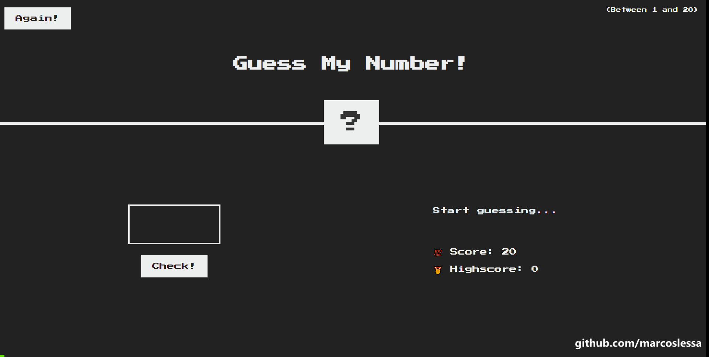

# Guess my number

This is a simple game project based on Jonas Schmedtmann's `"The Complete JavaScript Course"` to practice JavaScript and DOM manipulation.

## Game's objective:

The objective of this game is to guess a random number between in 1 and 20.

## Key topics:

- JavaScript
- DOM manipulation
- Refactoring
